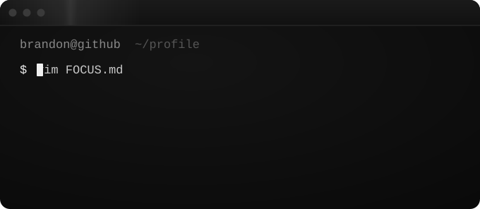

<h1 align="center">hello 💫, i'm brandon</h1>
<h3 align="center">a cybersecurity enthusiast dedicated to innovating and helping people understand how to protect their personal privacy.</h3>

  
  
  

---

- i’m currently working on <a href="https://branalytic.com">my first iOS app</a>  
- i’m currently learning <b>JavaScript, Swift, TypeScript, TailwindCSS, Expo React Native, Python</b>, while actively <b>improving my security posture</b>, and always learning new things about cybersecurity! i'm also diving deep into <b>large language models</b> and <b>agentic engineering</b>, learning everything i can about how these systems work and how to build with them.  
- most of my projects are available at <a href="https://branalytic.com/projects">branalytic.com/projects</a>  
- how to reach me: <b>hi@branalytic.com</b>

---

### Featured

  

---

### Languages & Tools

  
  
  
  
  
  
  
  
  

- **mobile & web:** Swift, TypeScript, JavaScript, React Native (Expo), TailwindCSS
- **ai & systems:** agentic engineering, LLM tooling, Python, Linux, Vim
- **security & privacy:** posture hardening, privacy-first architecture, digital autonomy

---

  
<b>more about my current focus & research</b>

   

  - **agentic engineering:** experimenting with multi-step reasoning, tool orchestration, autonomous dev loops, and local LLM execution.
  - **security posture:** continuous threat modeling, hardening personal devices/infrastructure, and building tools with zero telemetry.
  - **ios development:** learning idiomatic Swift and SwiftUI while shipping performant, user-respecting mobile software.

---
