  <picture>
    <source media="(prefers-color-scheme: dark)" srcset="assets/banner-dark.svg" />
    
  </picture>

<h1 align="center">Hello 💫, I'm brandon</h1>
<h3 align="center">A Cybersecurity enthusiast dedicated to innovating and helping people understand how to protect their personal privacy.</h3>

  
  
  
  

---

- i’m currently working on a <a href="https://branalytic.com">Front End Web Portfolio</a>  
- i’m currently learning <b>JavaScript, TypeScript, Python</b>, pursuing <b>SOC Level 1 skills on TryHackMe</b>, and always learning new things about cybersecurity!  
- all of my projects are available at <a href="https://branalytic.com/projects">branalytic.com/projects</a>  
- i regularly write articles on <a href="https://branalytic.com/blog">branalytic.com/blog</a>  
- how to reach me: <b>hi@branalytic.com</b>

---

### Featured

  

---

### Languages & Tools

  
  
  
  
  
  

---
